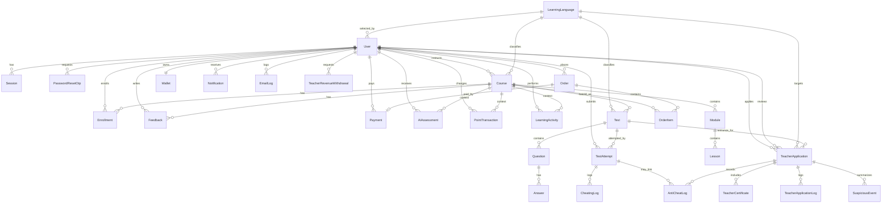

# Cau truc Database

Du an dung Prisma 7 voi PostgreSQL. Schema nam tai `prisma/schema.prisma`, Prisma Client duoc generate vao `app/generated/prisma`.

## Tong quan nhom bang

- **Tai khoan va phien dang nhap**: `User`, `Session`, `PasswordResetOtp`.
- **Khoa hoc va hoc tap**: `Course`, `Module`, `Lesson`, `Enrollment`, `Feedback`, `LearningActivity`.
- **Bai test**: `Test`, `Question`, `Answer`, `TestAttempt`, `CheatingLog`.
- **AI danh gia**: `AiAssessment`, `PointTransaction`, `SystemSetting`.
- **Dang ky giang vien**: `TeacherApplication`, `TeacherCertificate`, `TeacherApplicationLog`, `AntiCheatLog`, `SuspiciousEvent`.
- **Thanh toan va doanh thu**: `Wallet`, `Payment`, `Order`, `OrderItem`, `TeacherRevenueWithdrawal`.
- **Ngon ngu va thong bao**: `LearningLanguage`, `Notification`, `EmailLog`.

## Enum

### `Role`

- `STUDENT`: hoc vien mac dinh khi dang ky.
- `TEACHER`: giang vien tao khoa hoc, test, lesson.
- `ADMIN`: quan tri he thong.

### `CourseStatus`

- `ACTIVE`: khoa hoc dang cong khai.
- `LOCKED`: khoa hoc bi khoa, thuong khi co enrollment nen khong xoa vat ly.
- `PENDING_APPROVAL`: cho admin duyet.
- `REJECTED`: bi tu choi.

### `TestKind`

- `COURSE`: test gan voi khoa hoc.
- `PUBLIC_PRACTICE`: bai luyen cong khai.
- `TEACHER_ENTRANCE`: bai dau vao giang vien.

### `TestAssessmentMode`

- `STANDARD`: cham cau hoi khach quan/standard.
- `WRITING`: test co Writing AI.
- `SPEAKING`: test co Speaking AI.

### `QuestionType`

- `MULTIPLE_CHOICE`
- `FILL_IN_BLANK`
- `ESSAY`
- `TRUE_FALSE`
- `SPEAKING`

### `TeacherApplicationStatus`

- `DRAFT`
- `SUBMITTED`
- `UNDER_REVIEW`
- `APPROVED`
- `REJECTED`
- `EXPIRED`

### `TeacherRevenueWithdrawalStatus`

- `PENDING`
- `APPROVED`
- `PAID`
- `REJECTED`

## Bang va truong chinh

### `User`

Luu tai khoan nguoi dung.

Truong chinh:

- `id`: khoa chinh UUID.
- `username`, `email`, `password`.
- `email`: unique.
- `role`: `Role`, mac dinh `STUDENT`.
- `phoneNumber`, `isBanned`, `learningLanguageId`.
- `createdAt`.

Lien ket:

- 1-n `Session`, `PasswordResetOtp`, `Enrollment`, `TestAttempt`, `Feedback`, `Order`, `Payment`, `Course`, `AiAssessment`, `PointTransaction`, `LearningActivity`, `Notification`, `EmailLog`, `TeacherRevenueWithdrawal`.
- 1-1 `Wallet`.
- n-1 `LearningLanguage` qua `learningLanguageId`.
- 1-n `TeacherApplication` voi 2 vai tro: nguoi nop ho so va admin review.

### `Session`

Luu phien dang nhap server-side theo `tokenHash`.

Lien ket:

- n-1 `User`.
- Xoa cascade khi `User` bi xoa.

### `PasswordResetOtp`

Luu OTP dat lai mat khau.

Truong chinh:

- `userId`, `email`, `codeHash`, `expiresAt`, `consumedAt`, `attempts`.

Index:

- `[userId, createdAt]`
- `[email, createdAt]`

Lien ket:

- n-1 `User`, xoa cascade theo user.

### `LearningLanguage`

Danh muc ngon ngu hoc/tai lieu/test.

Truong chinh:

- `name` unique.
- `code` unique.
- `isActive`.

Lien ket:

- 1-n `User`, `Course`, `Test`, `TeacherApplication`.

### `Course`

Khoa hoc trong marketplace/LMS.

Truong chinh:

- `name`, `description`, `thumbnail`, `category`, `duration`, `lessons`.
- `status`: `CourseStatus`.
- `price`.
- `languageId`.
- `instructorId`.
- `createdAt`, `updatedAt`.

Lien ket:

- n-1 `User` qua `instructorId`.
- n-1 `LearningLanguage`.
- 1-n `Module`, `Enrollment`, `Test`, `Feedback`, `OrderItem`, `AiAssessment`, `PointTransaction`, `LearningActivity`.

### `Module`

Chuong/module cua khoa hoc.

Truong chinh:

- `courseId`, `name`, `order`.

Lien ket:

- n-1 `Course`.
- 1-n `Lesson`.

### `Lesson`

Bai hoc trong module.

Truong chinh:

- `moduleId`, `title`, `content`, `videoUrl`.

Lien ket:

- n-1 `Module`.

### `Enrollment`

Ghi nhan nguoi dung da mua/dang ky khoa hoc.

Truong chinh:

- `userId`, `courseId`, `createdAt`.

Rang buoc:

- `@@unique([userId, courseId])`: moi user chi enroll mot lan moi khoa.

Lien ket:

- n-1 `User`.
- n-1 `Course`.

### `Feedback`

Bang nay dang duoc dung cho 2 muc dich:

- Review khoa hoc cua hoc vien, noi dung co dang JSON `{ rating, comment }`.
- Marker tien do hoc tap/chung chi qua prefix:
  - `PROGRESS:<lessonId>`
  - `LESSON_START:<lessonId>`
  - `COURSE_COMPLETED:<courseId>`
  - `CERT_SENT:<courseId>`

Lien ket:

- n-1 `User`.
- n-1 `Course`.

Ghi chu: Day la bang "overloaded"; neu mo rong he thong, nen tach review va progress thanh bang rieng de de query va tranh nham nghia.

### `Test`

Bai test cua khoa hoc, bai luyen cong khai hoac bai dau vao giang vien.

Truong chinh:

- `courseId`, `languageId`.
- `kind`: `TestKind`.
- `assessmentMode`: `TestAssessmentMode`.
- `name`, `description`.
- `maxScore`, `passingScore`, `maxAttempts`, `timeLimit`.
- `shuffleQuestions`.
- `materialTitle`, `materialContent`, `materialUrl`, `materialType`, `materialData`.
- `createdAt`, `updatedAt`.

Lien ket:

- n-1 `Course`.
- n-1 `LearningLanguage`.
- 1-n `Question`, `TestAttempt`, `TeacherApplication`.

### `Question`

Cau hoi trong test.

Truong chinh:

- `testId`, `type`, `content`, `audioUrl`, `order`, `score`, `explanation`, `hint`.

Lien ket:

- n-1 `Test`.
- 1-n `Answer`.

### `Answer`

Dap an cua cau hoi.

Truong chinh:

- `questionId`, `content`, `isCorrect`, `order`, `feedback`.

Lien ket:

- n-1 `Question`.

### `TestAttempt`

Lan nop bai cua user.

Truong chinh:

- `testId`, `userId`, `attemptNo`.
- `score`, `maxScore`, `answers`, `results`.
- `startedAt`, `submittedAt`, `isPassed`.

Rang buoc:

- `@@unique([testId, userId, attemptNo])`

Lien ket:

- n-1 `Test`.
- n-1 `User`.
- 1-n `CheatingLog`, `AntiCheatLog`.

### `CheatingLog`

Log gian lan gan truc tiep voi `TestAttempt`.

Lien ket:

- n-1 `TestAttempt`.

### `AiAssessment`

Ket qua cham AI cho writing/speaking.

Truong chinh:

- `userId`, `courseId`.
- `type`: chuoi, thuc te dung `WRITING`/`SPEAKING`.
- `taskType`, `title`, `prompt`, `submissionText`, `audioUrl`, `durationSeconds`.
- `score`, `maxScore`, `bandSystem`, `bandLevel`, `bandScore`.
- `criteria`, `feedback`, `mistakes`, `improvements`, `sampleAnswer`.
- `startedAt`, `submittedAt`, `createdAt`, `updatedAt`.

Index:

- `[userId, submittedAt]`
- `[courseId, submittedAt]`
- `[type, submittedAt]`

Lien ket:

- n-1 `User`, xoa cascade theo user.
- n-1 `Course`.

### `PointTransaction`

So cai diem/hat dau AI.

Truong chinh:

- `userId`, `courseId`, `type`, `amount`, `balanceAfter`.
- `sourceKey`: unique, dung de idempotent.
- `description`, `metadata`, `createdAt`.

Index:

- `[userId, createdAt]`
- `[type, createdAt]`

Lien ket:

- n-1 `User`, xoa cascade theo user.
- n-1 `Course`.

### `LearningActivity`

Ghi nhan ngay hoc de tinh streak/analytics.

Truong chinh:

- `userId`, `courseId`, `activityType`, `sourceKey`, `activityDate`, `createdAt`.

Rang buoc:

- `sourceKey` unique.

Index:

- `[userId, activityDate]`
- `[activityType, createdAt]`

Lien ket:

- n-1 `User`, xoa cascade theo user.
- n-1 `Course`.

### `SystemSetting`

Key-value setting dung JSON.

Truong chinh:

- `key`: khoa chinh.
- `value`: JSON.
- `updatedAt`.

Thuc te dang dung cho:

- Bat/tat dang ky dau vao giang vien.
- Bat/tat auto approve khoa hoc.
- Cau hinh Speaking AI.

### `TeacherApplication`

Ho so dang ky tro thanh giang vien.

Truong chinh:

- `userId`, `languageId`, `status`, `attemptNo`.
- `entranceTestId`, `entranceAttemptId`.
- `answerState`.
- `startedAt`, `submittedAt`, `reviewedAt`, `reviewedById`.
- `rejectionReason`, `createdAt`, `updatedAt`.

Index:

- `[userId, createdAt]`
- `[status, createdAt]`

Lien ket:

- n-1 `User` qua relation `TeacherApplicationUser`, xoa cascade theo user.
- n-1 `LearningLanguage`.
- n-1 `Test` qua `entranceTestId`.
- n-1 `User` qua relation `TeacherApplicationReviewer`.
- 1-n `TeacherCertificate`, `TeacherApplicationLog`, `AntiCheatLog`, `SuspiciousEvent`.

### `TeacherCertificate`

File chung chi upload trong ho so giang vien.

Lien ket:

- n-1 `TeacherApplication`, xoa cascade theo application.

### `TeacherApplicationLog`

Nhat ky trang thai ho so giang vien.

Lien ket:

- n-1 `TeacherApplication`, xoa cascade theo application.

### `AntiCheatLog`

Log anti-cheat cho ho so/bai test dau vao.

Index:

- `[applicationId, serverTimestamp]`

Lien ket:

- n-1 `TeacherApplication`, xoa cascade theo application.
- n-1 `TestAttempt` tuy chon.

### `SuspiciousEvent`

Tong hop su kien dang nghi theo loai.

Rang buoc:

- `@@unique([applicationId, eventType])`

Lien ket:

- n-1 `TeacherApplication`, xoa cascade theo application.

### `Notification`

Thong bao noi bo cho user.

Lien ket:

- n-1 `User`, xoa cascade theo user.

### `EmailLog`

Lich su gui email.

Lien ket:

- n-1 `User` tuy chon, khi user bi xoa thi `userId` set null.

### `Order`

Don hang. Dung cho mua khoa hoc va nap vi.

Lien ket:

- n-1 `User`.
- 1-n `OrderItem`.
- 1-1 `Payment`.

### `OrderItem`

Dong hang khoa hoc trong order.

Truong chinh:

- `orderId`, `courseId`, `price`.
- `adminRevenue`, `teacherRevenue`, `revenueSplit`.

Lien ket:

- n-1 `Order`.
- n-1 `Course`.

### `Wallet`

Vi tien noi bo cua user.

Truong chinh:

- `userId`: unique.
- `balance`.

Lien ket:

- 1-1 `User`, xoa cascade theo user.

### `Payment`

Giao dich thanh toan/nap vi qua VNPAY.

Truong chinh:

- `orderId`: unique tuy chon.
- `userId`, `provider`, `txnRef`: unique.
- `amount`, `status`.
- `orderInfo`, `bankCode`, `transactionNo`, `responseCode`, `transactionStatus`, `payDate`, `rawResponse`.

Index:

- `[userId, createdAt]`
- `[status, createdAt]`

Lien ket:

- n-1 `User`, xoa cascade theo user.
- 1-1 `Order` tuy chon.

### `TeacherRevenueWithdrawal`

Yeu cau rut doanh thu cua giang vien.

Truong chinh:

- `teacherId`, `amount`.
- `bankName`, `accountNumber`, `accountName`.
- `status`, `note`, `processedAt`, `createdAt`, `updatedAt`.

Index:

- `[teacherId, createdAt]`
- `[status, createdAt]`

Lien ket:

- n-1 `User` trong vai tro teacher, xoa cascade theo user.

## So do ERD

## Cac luu y thiet ke

- `Feedback` dang kiem nhiem review va progress marker; nen tach thanh `CourseReview`, `LessonProgress`, `CourseCompletion` khi can bao cao lon.
- `Session` ton tai trong schema nhung flow auth hien tai dung cookie token HMAC tu `lib/auth.ts`, khong thay tao `Session` trong cac route auth hien co.
- Wallet duoc tinh bang `Wallet.balance`, co the doi chieu voi ledger tu `Payment`, `OrderItem`, `PointTransaction`.
- `PointTransaction.sourceKey` va `LearningActivity.sourceKey` duoc dung de chong ghi trung.
- `Order` duoc dung cho ca nap vi va mua khoa hoc; order nap vi co `Payment`, order mua khoa hoc co `OrderItem`.
