# Use-case va so do tuan tu

Tai lieu nay tong hop cac chuc nang duoc suy ra tu `app/page.tsx`, `app/**/page.tsx`, `app/api/**/route.ts` va cac service trong `lib/**`.

## Tac nhan

- **Guest**: xem trang public, dang ky, dang nhap, quen mat khau, xem danh sach khoa hoc/giang vien.
- **Student**: mua khoa hoc, hoc bai, lam test, xem ket qua, dung AI, nap vi, danh gia khoa hoc, dang ky lam giang vien.
- **Teacher**: quan ly khoa hoc/module/lesson/test/question, xem hoc vien, rut doanh thu, preview test, dung AI.
- **Admin**: dashboard analytics, quan ly user, setting he thong, duyet ho so giang vien, duyet khoa hoc, xu ly rut doanh thu.
- **VNPAY**: cong thanh toan nap vi.
- **Ollama AI**: dich vu cham/generate noi dung AI.
- **Email service**: gui OTP, thong bao, chung chi.

## UC01 - Dang ky tai khoan

Endpoint: `POST /api/auth/register`

Dieu kien:

- Guest gui `username`, `email`, `password`, `confirmPassword`.
- Password phai du manh, email unique.

Ket qua:

- Tao `User` role `STUDENT`.
- Tao cookie auth HMAC.
- Tra ve redirect theo role.

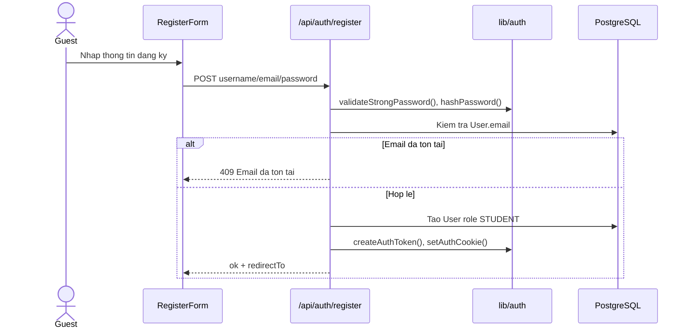
```mermaid
sequenceDiagram
  actor Guest
  participant UI as RegisterForm
  participant API as /api/auth/register
  participant Auth as lib/auth
  participant DB as PostgreSQL

  Guest->>UI: Nhap thong tin dang ky
  UI->>API: POST username/email/password
  API->>Auth: validateStrongPassword(), hashPassword()
  API->>DB: Kiem tra User.email
  alt Email da ton tai
    API-->>UI: 409 Email da ton tai
  else Hop le
    API->>DB: Tao User role STUDENT
    API->>Auth: createAuthToken(), setAuthCookie()
    API-->>UI: ok + redirectTo
  end
```

## UC02 - Dang nhap, dang xuat va lay user hien tai

Endpoints:

- `POST /api/auth/login`
- `POST /api/auth/logout`
- `GET /api/auth/me`

Dieu kien:

- User khong bi `isBanned`.

Ket qua:

- Login set cookie `auth_token`.
- Logout xoa cookie.
- Me tra ve thong tin user tu cookie hop le.

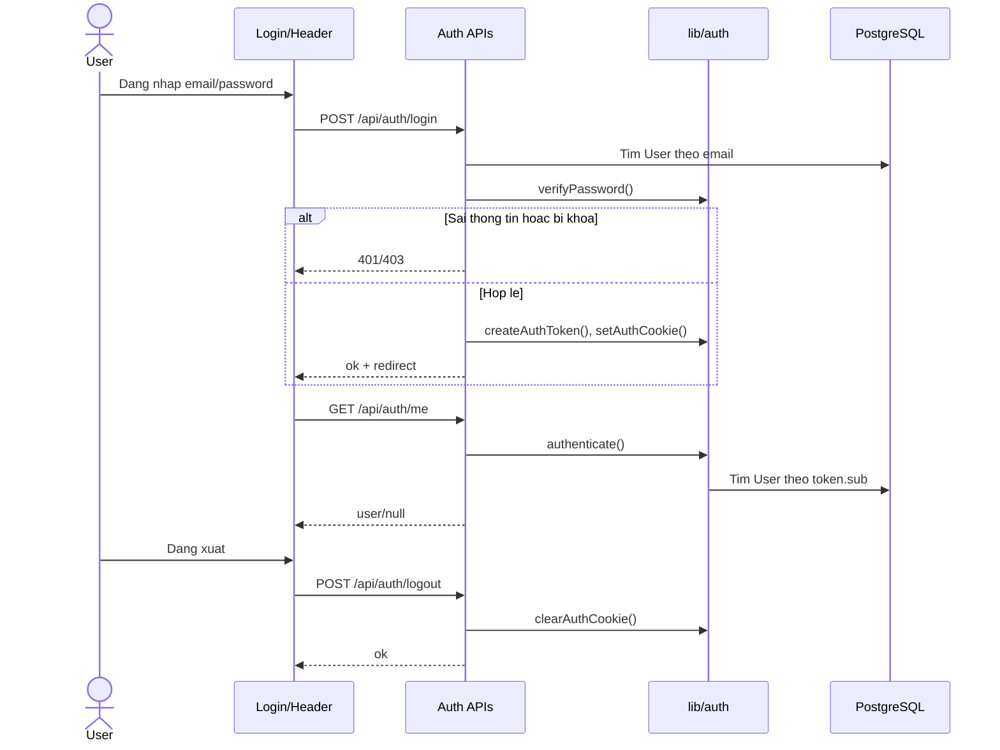
```mermaid
sequenceDiagram
  actor User
  participant UI as Login/Header
  participant API as Auth APIs
  participant Auth as lib/auth
  participant DB as PostgreSQL

  User->>UI: Dang nhap email/password
  UI->>API: POST /api/auth/login
  API->>DB: Tim User theo email
  API->>Auth: verifyPassword()
  alt Sai thong tin hoac bi khoa
    API-->>UI: 401/403
  else Hop le
    API->>Auth: createAuthToken(), setAuthCookie()
    API-->>UI: ok + redirect
  end
  UI->>API: GET /api/auth/me
  API->>Auth: authenticate()
  Auth->>DB: Tim User theo token.sub
  API-->>UI: user/null
  User->>UI: Dang xuat
  UI->>API: POST /api/auth/logout
  API->>Auth: clearAuthCookie()
  API-->>UI: ok
```

## UC03 - Quen mat khau bang OTP

Endpoints:

- `POST /api/auth/forgot-password/request-otp`
- `POST /api/auth/forgot-password/reset`

Dieu kien:

- Tai khoan admin khong duoc reset bang OTP.
- OTP co han, gioi han so lan thu.

Ket qua:

- Tao `PasswordResetOtp`.
- Gui email OTP.
- Doi `User.password` va consume OTP khi ma dung.

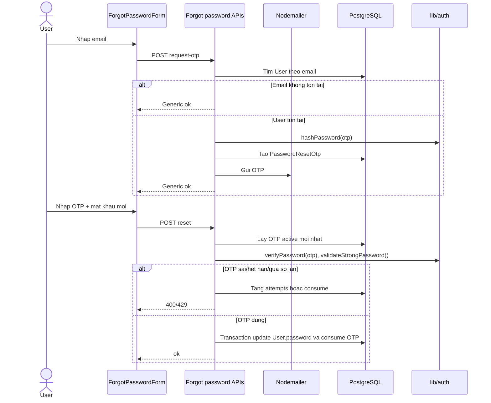
```mermaid
sequenceDiagram
  actor User
  participant UI as ForgotPasswordForm
  participant API as Forgot password APIs
  participant Mail as Nodemailer
  participant DB as PostgreSQL
  participant Auth as lib/auth

  User->>UI: Nhap email
  UI->>API: POST request-otp
  API->>DB: Tim User theo email
  alt Email khong ton tai
    API-->>UI: Generic ok
  else User ton tai
    API->>Auth: hashPassword(otp)
    API->>DB: Tao PasswordResetOtp
    API->>Mail: Gui OTP
    API-->>UI: Generic ok
  end
  User->>UI: Nhap OTP + mat khau moi
  UI->>API: POST reset
  API->>DB: Lay OTP active moi nhat
  API->>Auth: verifyPassword(otp), validateStrongPassword()
  alt OTP sai/het han/qua so lan
    API->>DB: Tang attempts hoac consume
    API-->>UI: 400/429
  else OTP dung
    API->>DB: Transaction update User.password va consume OTP
    API-->>UI: ok
  end
```

## UC04 - Ho so ca nhan va doi mat khau

Endpoints:

- `PATCH /api/profile`
- `POST /api/profile/password`

Ket qua:

- Cap nhat username/phone/learning language.
- Doi mat khau sau khi xac minh mat khau hien tai.

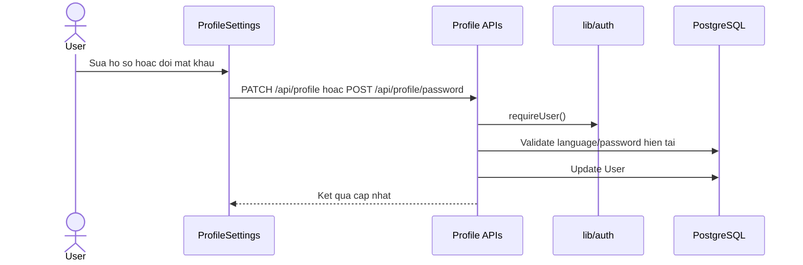
```mermaid
sequenceDiagram
  actor User
  participant UI as ProfileSettings
  participant API as Profile APIs
  participant Auth as lib/auth
  participant DB as PostgreSQL

  User->>UI: Sua ho so hoac doi mat khau
  UI->>API: PATCH /api/profile hoac POST /api/profile/password
  API->>Auth: requireUser()
  API->>DB: Validate language/password hien tai
  API->>DB: Update User
  API-->>UI: Ket qua cap nhat
```

## UC05 - Ngon ngu hoc

Endpoints:

- `GET /api/languages`
- `POST /api/languages`

Ket qua:

- Lay danh sach `LearningLanguage` active.
- Tao ngon ngu moi khi co quyen phu hop.

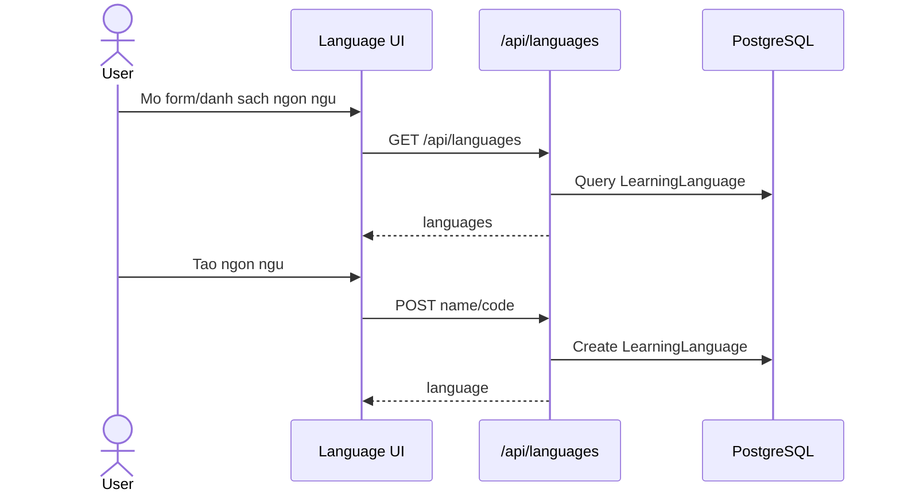
```mermaid
sequenceDiagram
  actor User
  participant UI as Language UI
  participant API as /api/languages
  participant DB as PostgreSQL

  User->>UI: Mo form/danh sach ngon ngu
  UI->>API: GET /api/languages
  API->>DB: Query LearningLanguage
  API-->>UI: languages
  User->>UI: Tao ngon ngu
  UI->>API: POST name/code
  API->>DB: Create LearningLanguage
  API-->>UI: language
```

## UC06 - Xem khoa hoc, chi tiet, quyen truy cap

Endpoints:

- `GET /api/courses`
- `GET /api/courses/[id]/access`
- Pages: `/`, `/courses`, `/courses/[id]`, `/teachers`, `/teachers/[id]`, `/top-students`

Ket qua:

- Liet ke khoa hoc `ACTIVE`.
- Kiem tra user la instructor hoac da enroll.

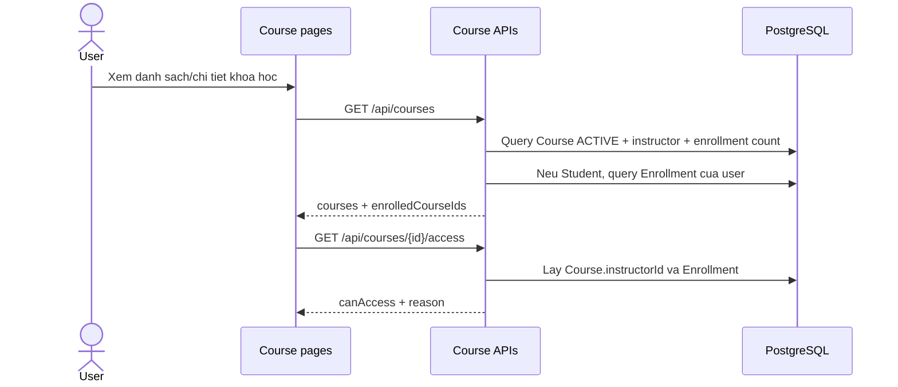
```mermaid
sequenceDiagram
  actor User
  participant UI as Course pages
  participant API as Course APIs
  participant DB as PostgreSQL

  User->>UI: Xem danh sach/chi tiet khoa hoc
  UI->>API: GET /api/courses
  API->>DB: Query Course ACTIVE + instructor + enrollment count
  API->>DB: Neu Student, query Enrollment cua user
  API-->>UI: courses + enrolledCourseIds
  UI->>API: GET /api/courses/{id}/access
  API->>DB: Lay Course.instructorId va Enrollment
  API-->>UI: canAccess + reason
```

## UC07 - Nap vi bang VNPAY

Endpoints:

- `GET /api/wallet`
- `POST /api/wallet/top-up`
- `GET /api/wallet/vnpay-ipn`
- `GET /api/wallet/vnpay-return`

Dieu kien:

- User phai dang nhap, admin khong dung vi.
- So tien toi thieu 10.000 VND.

Ket qua:

- Tao `Order`, `Payment` PENDING, `Wallet`.
- Redirect sang VNPAY.
- IPN hop le cap nhat `Payment.status`, tang `Wallet.balance`.

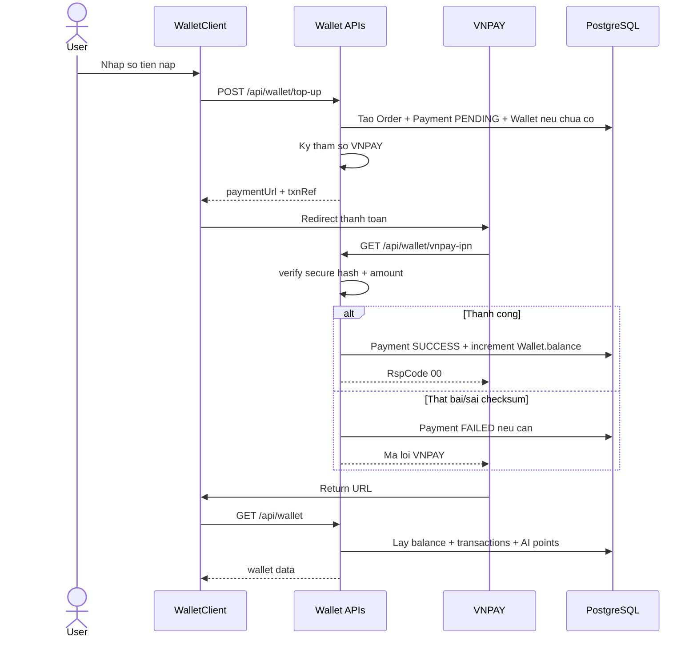
```mermaid
sequenceDiagram
  actor User
  participant UI as WalletClient
  participant API as Wallet APIs
  participant VNPAY as VNPAY
  participant DB as PostgreSQL

  User->>UI: Nhap so tien nap
  UI->>API: POST /api/wallet/top-up
  API->>DB: Tao Order + Payment PENDING + Wallet neu chua co
  API->>API: Ky tham so VNPAY
  API-->>UI: paymentUrl + txnRef
  UI->>VNPAY: Redirect thanh toan
  VNPAY->>API: GET /api/wallet/vnpay-ipn
  API->>API: verify secure hash + amount
  alt Thanh cong
    API->>DB: Payment SUCCESS + increment Wallet.balance
    API-->>VNPAY: RspCode 00
  else That bai/sai checksum
    API->>DB: Payment FAILED neu can
    API-->>VNPAY: Ma loi VNPAY
  end
  VNPAY->>UI: Return URL
  UI->>API: GET /api/wallet
  API->>DB: Lay balance + transactions + AI points
  API-->>UI: wallet data
```

## UC08 - Mua/dang ky khoa hoc bang vi

Endpoint: `POST /api/courses/[id]/enroll`

Dieu kien:

- Course phai `ACTIVE`, tru instructor co the enroll course cua minh.
- Neu da enroll thi tra `alreadyEnrolled`.
- Wallet du so du neu mua course cua nguoi khac.

Ket qua:

- Tru `Wallet.balance`.
- Tao `Order`, `OrderItem`, `Enrollment`.
- Tinh revenue split: course cua teacher chia 70% teacher, 30% admin; course khac admin-only.

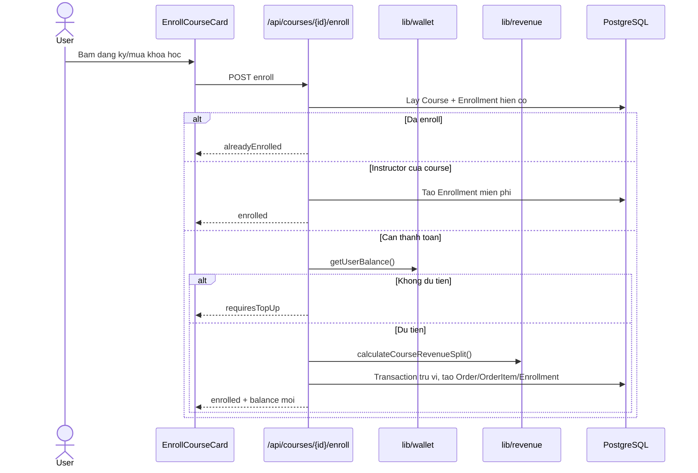
```mermaid
sequenceDiagram
  actor User
  participant UI as EnrollCourseCard
  participant API as /api/courses/{id}/enroll
  participant Wallet as lib/wallet
  participant Revenue as lib/revenue
  participant DB as PostgreSQL

  User->>UI: Bam dang ky/mua khoa hoc
  UI->>API: POST enroll
  API->>DB: Lay Course + Enrollment hien co
  alt Da enroll
    API-->>UI: alreadyEnrolled
  else Instructor cua course
    API->>DB: Tao Enrollment mien phi
    API-->>UI: enrolled
  else Can thanh toan
    API->>Wallet: getUserBalance()
    alt Khong du tien
      API-->>UI: requiresTopUp
    else Du tien
      API->>Revenue: calculateCourseRevenueSplit()
      API->>DB: Transaction tru vi, tao Order/OrderItem/Enrollment
      API-->>UI: enrolled + balance moi
    end
  end
```

## UC09 - Hoc bai va ghi tien do

Endpoints:

- `POST /api/learning/lessons/[lessonId]/start`
- `POST /api/learning/lessons/[lessonId]/complete`
- Page: `/student/hoc-bai`

Dieu kien:

- User la admin, instructor, hoac da enroll course.
- Bai doc khong video phai hoc toi thieu 10 phut sau khi start.
- Bai co video phai xem het va khong tua theo payload client.

Ket qua:

- Ghi marker progress vao `Feedback`.
- Ghi `LearningActivity` de tinh streak.

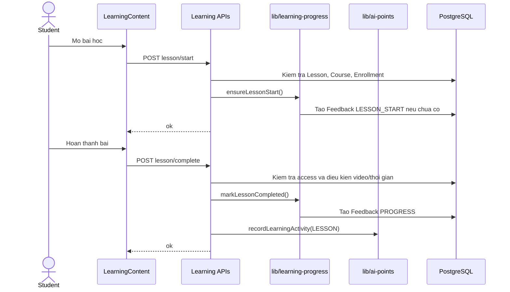
```mermaid
sequenceDiagram
  actor Student
  participant UI as LearningContent
  participant API as Learning APIs
  participant Progress as lib/learning-progress
  participant Activity as lib/ai-points
  participant DB as PostgreSQL

  Student->>UI: Mo bai hoc
  UI->>API: POST lesson/start
  API->>DB: Kiem tra Lesson, Course, Enrollment
  API->>Progress: ensureLessonStart()
  Progress->>DB: Tao Feedback LESSON_START neu chua co
  API-->>UI: ok
  Student->>UI: Hoan thanh bai
  UI->>API: POST lesson/complete
  API->>DB: Kiem tra access va dieu kien video/thoi gian
  API->>Progress: markLessonCompleted()
  Progress->>DB: Tao Feedback PROGRESS
  API->>Activity: recordLearningActivity(LESSON)
  API-->>UI: ok
```

## UC10 - Lam test khoa hoc/public practice va xem ket qua

Endpoints:

- `GET /api/student/tests`
- `GET /api/student/tests/[testId]`
- `POST /api/student/tests/[testId]/submit`
- `GET /api/student/tests/history`
- `GET /api/student/tests/[testId]/attempts/[attemptId]`
- `GET /api/student/results`
- `GET /api/student/results/[resultId]`

Dieu kien:

- Course test yeu cau enroll va progress 100%, tru owner preview.
- Tong diem cau hoi phai bang `FIXED_TEST_MAX_SCORE` 100.
- `TEACHER_ENTRANCE` khong nop qua student test flow.

Ket qua:

- Tao `TestAttempt`.
- Cau hoi objective cham tu dong.
- Essay/Speaking goi AI de cham.
- Neu pass course test: ghi course completed, co the gui email chung chi, ghi activity/points.

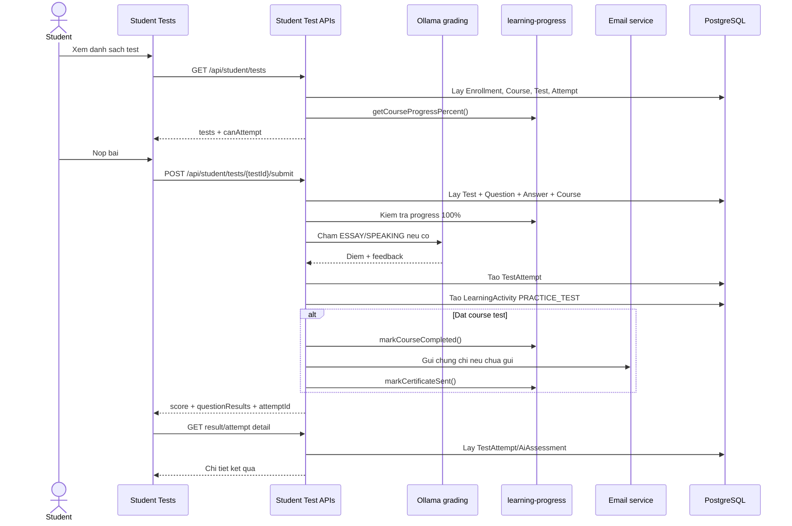
```mermaid
sequenceDiagram
  actor Student
  participant UI as Student Tests
  participant API as Student Test APIs
  participant AI as Ollama grading
  participant Progress as learning-progress
  participant Mail as Email service
  participant DB as PostgreSQL

  Student->>UI: Xem danh sach test
  UI->>API: GET /api/student/tests
  API->>DB: Lay Enrollment, Course, Test, Attempt
  API->>Progress: getCourseProgressPercent()
  API-->>UI: tests + canAttempt
  Student->>UI: Nop bai
  UI->>API: POST /api/student/tests/{testId}/submit
  API->>DB: Lay Test + Question + Answer + Course
  API->>Progress: Kiem tra progress 100%
  API->>AI: Cham ESSAY/SPEAKING neu co
  AI-->>API: Diem + feedback
  API->>DB: Tao TestAttempt
  API->>DB: Tao LearningActivity PRACTICE_TEST
  alt Dat course test
    API->>Progress: markCourseCompleted()
    API->>Mail: Gui chung chi neu chua gui
    API->>Progress: markCertificateSent()
  end
  API-->>UI: score + questionResults + attemptId
  UI->>API: GET result/attempt detail
  API->>DB: Lay TestAttempt/AiAssessment
  API-->>UI: Chi tiet ket qua
```

## UC11 - Danh gia khoa hoc

Endpoints:

- `GET /api/courses/[id]/reviews`
- `POST /api/courses/[id]/reviews`

Dieu kien:

- Chi `STUDENT` da hoan thanh khoa hoc va dat test moi duoc review.
- Rating 1-5, comment toi da 1000 ky tu.

Ket qua:

- Upsert review vao `Feedback`.

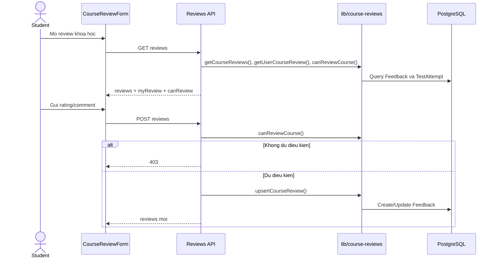
```mermaid
sequenceDiagram
  actor Student
  participant UI as CourseReviewForm
  participant API as Reviews API
  participant Reviews as lib/course-reviews
  participant DB as PostgreSQL

  Student->>UI: Mo review khoa hoc
  UI->>API: GET reviews
  API->>Reviews: getCourseReviews(), getUserCourseReview(), canReviewCourse()
  Reviews->>DB: Query Feedback va TestAttempt
  API-->>UI: reviews + myReview + canReview
  Student->>UI: Gui rating/comment
  UI->>API: POST reviews
  API->>Reviews: canReviewCourse()
  alt Khong du dieu kien
    API-->>UI: 403
  else Du dieu kien
    API->>Reviews: upsertCourseReview()
    Reviews->>DB: Create/Update Feedback
    API-->>UI: reviews moi
  end
```

## UC12 - Writing AI va tao de writing

Endpoints:

- `POST /api/ai/writing-prompt`
- `POST /api/ai/essay-evaluation`
- `GET /api/ai/essay-evaluation`
- Page: `/student/writing-ai`

Dieu kien:

- User dang nhap.
- Neu co `courseId`, user phai co quyen voi course.
- Neu yeu cau feedback chi tiet, student/teacher co the bi tru AI points.
- Ollama phai healthy de cham bai.

Ket qua:

- Tao prompt writing hoac fallback prompt.
- Tao `AiAssessment` type `WRITING`.
- Ghi `PointTransaction` neu mua feedback, ghi `LearningActivity`.

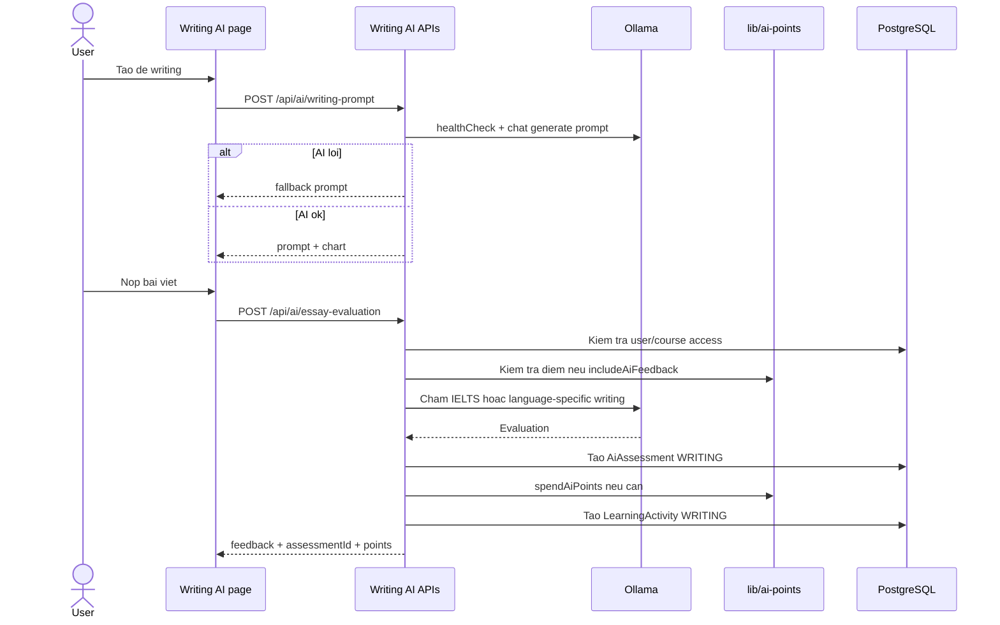
```mermaid
sequenceDiagram
  actor User
  participant UI as Writing AI page
  participant API as Writing AI APIs
  participant AI as Ollama
  participant Points as lib/ai-points
  participant DB as PostgreSQL

  User->>UI: Tao de writing
  UI->>API: POST /api/ai/writing-prompt
  API->>AI: healthCheck + chat generate prompt
  alt AI loi
    API-->>UI: fallback prompt
  else AI ok
    API-->>UI: prompt + chart
  end
  User->>UI: Nop bai viet
  UI->>API: POST /api/ai/essay-evaluation
  API->>DB: Kiem tra user/course access
  API->>Points: Kiem tra diem neu includeAiFeedback
  API->>AI: Cham IELTS hoac language-specific writing
  AI-->>API: Evaluation
  API->>DB: Tao AiAssessment WRITING
  API->>Points: spendAiPoints neu can
  API->>DB: Tao LearningActivity WRITING
  API-->>UI: feedback + assessmentId + points
```

## UC13 - Speaking AI

Endpoints:

- `GET /api/ai/speaking-evaluation/config`
- `POST /api/ai/speaking-evaluation/topic`
- `POST /api/ai/speaking-evaluation`
- `GET/PUT /api/admin/speaking-config`
- Page: `/student/speaking-ai`

Dieu kien:

- User dang nhap.
- Transcript bat buoc va phai qua validate/sanitize.
- Neu include feedback chi tiet, tru AI points theo `SPEAKING_AI_COST`.

Ket qua:

- Sinh topic noi, ghi file audio vao `public/uploads/speaking`, tao `AiAssessment` type `SPEAKING`.

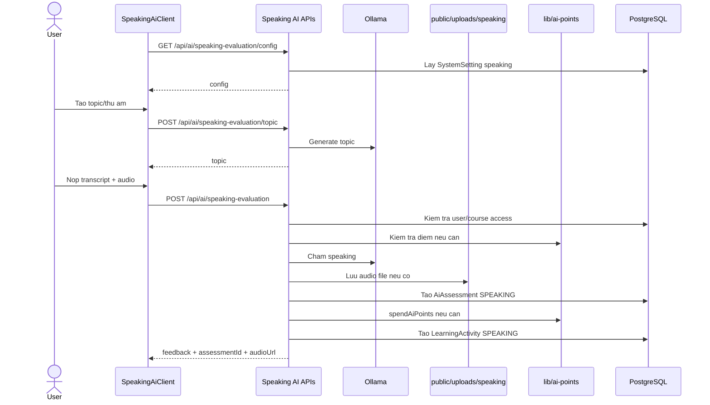
```mermaid
sequenceDiagram
  actor User
  participant UI as SpeakingAiClient
  participant API as Speaking AI APIs
  participant AI as Ollama
  participant FS as public/uploads/speaking
  participant Points as lib/ai-points
  participant DB as PostgreSQL

  UI->>API: GET /api/ai/speaking-evaluation/config
  API->>DB: Lay SystemSetting speaking
  API-->>UI: config
  User->>UI: Tao topic/thu am
  UI->>API: POST /api/ai/speaking-evaluation/topic
  API->>AI: Generate topic
  API-->>UI: topic
  User->>UI: Nop transcript + audio
  UI->>API: POST /api/ai/speaking-evaluation
  API->>DB: Kiem tra user/course access
  API->>Points: Kiem tra diem neu can
  API->>AI: Cham speaking
  API->>FS: Luu audio file neu co
  API->>DB: Tao AiAssessment SPEAKING
  API->>Points: spendAiPoints neu can
  API->>DB: Tao LearningActivity SPEAKING
  API-->>UI: feedback + assessmentId + audioUrl
```

## UC14 - Mua va su dung diem/hat dau AI

Endpoints:

- `GET /api/ai/points`
- `POST /api/ai/points/buy`
- `POST /api/ai/points/spend`

Dieu kien:

- Admin khong can mua points.
- Mua points tru tien tu wallet.

Ket qua:

- Tao `PointTransaction` type `AI_POINTS_PURCHASE`.
- Khi dung AI chi tiet, tao transaction amount am theo feature.

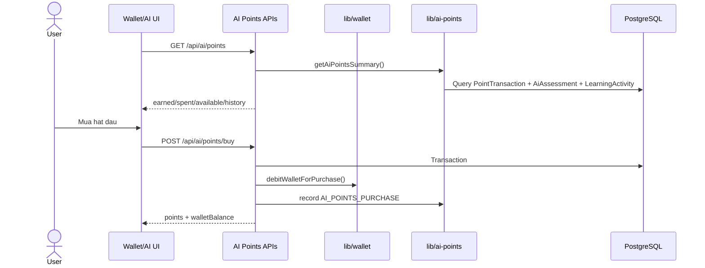
```mermaid
sequenceDiagram
  actor User
  participant UI as Wallet/AI UI
  participant API as AI Points APIs
  participant Wallet as lib/wallet
  participant Points as lib/ai-points
  participant DB as PostgreSQL

  UI->>API: GET /api/ai/points
  API->>Points: getAiPointsSummary()
  Points->>DB: Query PointTransaction + AiAssessment + LearningActivity
  API-->>UI: earned/spent/available/history
  User->>UI: Mua hat dau
  UI->>API: POST /api/ai/points/buy
  API->>DB: Transaction
  API->>Wallet: debitWalletForPurchase()
  API->>Points: record AI_POINTS_PURCHASE
  API-->>UI: points + walletBalance
```

## UC15 - Dang ky tro thanh giang vien

Endpoints:

- `GET /api/teacher-applications`
- `POST /api/teacher-applications`
- `PATCH /api/teacher-applications/[applicationId]/autosave`
- `POST /api/teacher-applications/[applicationId]/anti-cheat`
- `POST /api/teacher-applications/[applicationId]/submit-test`
- Page: `/teacher-registration`

Dieu kien:

- Chuc nang teacher entrance phai enabled trong `SystemSetting`.
- Student/Teacher upload 1-3 chung chi JPG/PNG/PDF, moi file toi da 10MB, co expiry date.
- Neu co entrance test theo ngon ngu, application bat dau `DRAFT`; neu khong co test thi `UNDER_REVIEW`.

Ket qua:

- Tao `TeacherApplication`, `TeacherCertificate`.
- Ghi anti-cheat/suspicious events.
- Nop bai dau vao tao `TestAttempt`, chuyen `UNDER_REVIEW`.

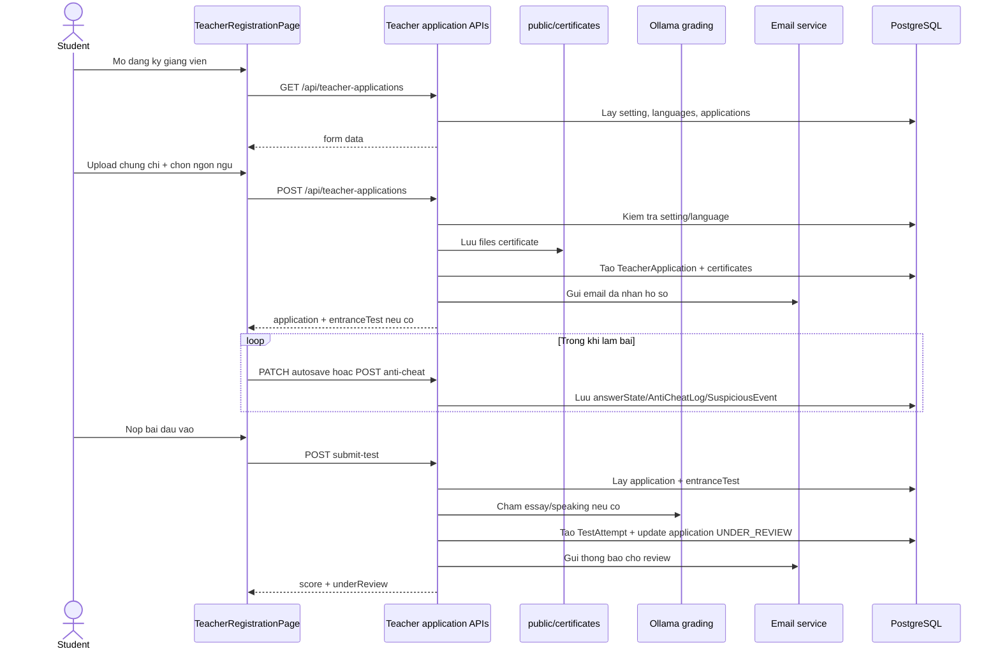
```mermaid
sequenceDiagram
  actor Student
  participant UI as TeacherRegistrationPage
  participant API as Teacher application APIs
  participant FS as public/certificates
  participant AI as Ollama grading
  participant Mail as Email service
  participant DB as PostgreSQL

  Student->>UI: Mo dang ky giang vien
  UI->>API: GET /api/teacher-applications
  API->>DB: Lay setting, languages, applications
  API-->>UI: form data
  Student->>UI: Upload chung chi + chon ngon ngu
  UI->>API: POST /api/teacher-applications
  API->>DB: Kiem tra setting/language
  API->>FS: Luu files certificate
  API->>DB: Tao TeacherApplication + certificates
  API->>Mail: Gui email da nhan ho so
  API-->>UI: application + entranceTest neu co
  loop Trong khi lam bai
    UI->>API: PATCH autosave hoac POST anti-cheat
    API->>DB: Luu answerState/AntiCheatLog/SuspiciousEvent
  end
  Student->>UI: Nop bai dau vao
  UI->>API: POST submit-test
  API->>DB: Lay application + entranceTest
  API->>AI: Cham essay/speaking neu co
  API->>DB: Tao TestAttempt + update application UNDER_REVIEW
  API->>Mail: Gui thong bao cho review
  API-->>UI: score + underReview
```

## UC16 - Admin duyet ho so giang vien

Endpoints:

- `GET /api/admin/teacher-applications`
- `PUT /api/admin/teacher-applications/[applicationId]/review`

Ket qua:

- Admin xem ho so, chung chi, attempt, anti-cheat.
- Approve thi update `TeacherApplication.status=APPROVED` va `User.role=TEACHER`.
- Reject thi luu ly do, tao notification/email.

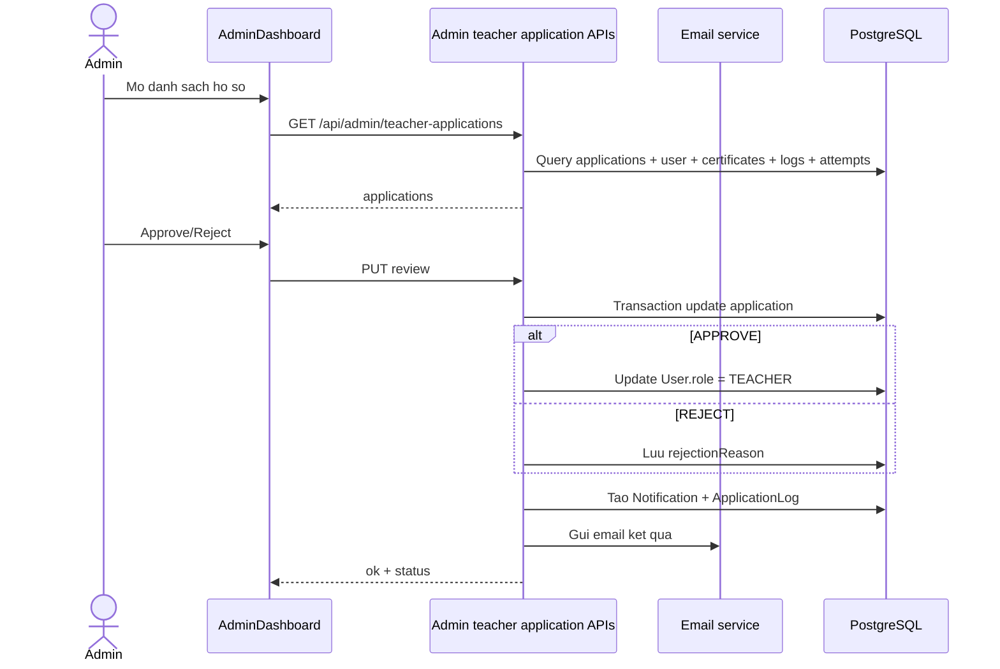
```mermaid
sequenceDiagram
  actor Admin
  participant UI as AdminDashboard
  participant API as Admin teacher application APIs
  participant Mail as Email service
  participant DB as PostgreSQL

  Admin->>UI: Mo danh sach ho so
  UI->>API: GET /api/admin/teacher-applications
  API->>DB: Query applications + user + certificates + logs + attempts
  API-->>UI: applications
  Admin->>UI: Approve/Reject
  UI->>API: PUT review
  API->>DB: Transaction update application
  alt APPROVE
    API->>DB: Update User.role = TEACHER
  else REJECT
    API->>DB: Luu rejectionReason
  end
  API->>DB: Tao Notification + ApplicationLog
  API->>Mail: Gui email ket qua
  API-->>UI: ok + status
```

## UC17 - Teacher quan ly khoa hoc, module, lesson va upload

Endpoints:

- `GET/POST /api/teacher/courses`
- `GET/PUT/PATCH/DELETE /api/teacher/courses/[courseId]`
- `GET/POST /api/teacher/courses/[courseId]/modules`
- `GET/PUT/DELETE /api/teacher/courses/[courseId]/modules/[moduleId]`
- `GET/POST /api/teacher/courses/[courseId]/modules/[moduleId]/lessons`
- `GET/PUT/DELETE /api/teacher/courses/[courseId]/modules/[moduleId]/lessons/[lessonId]`
- `POST /api/teacher/upload`
- `POST /api/teacher/upload-thumbnail`
- Pages: `/teacher/courses`, `/teacher/courses/[courseId]`, `/teacher/courses/[courseId]/modules/[moduleId]`

Dieu kien:

- User la `TEACHER` hoac `ADMIN`.
- Teacher chi quan ly course cua minh; admin quan ly tat ca.
- Teacher tao/sua course co the bi dua vao `PENDING_APPROVAL` tuy setting auto approval.
- Course co enrollment khi delete se bi `LOCKED` thay vi xoa.

Ket qua:

- CRUD `Course`, `Module`, `Lesson`.
- Cap nhat dem `Course.lessons`.
- Upload video/thumbnail vao `public`.

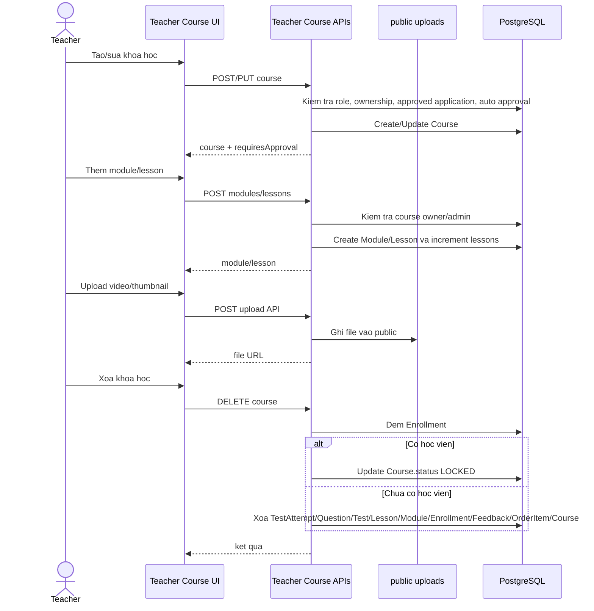
```mermaid
sequenceDiagram
  actor Teacher
  participant UI as Teacher Course UI
  participant API as Teacher Course APIs
  participant FS as public uploads
  participant DB as PostgreSQL

  Teacher->>UI: Tao/sua khoa hoc
  UI->>API: POST/PUT course
  API->>DB: Kiem tra role, ownership, approved application, auto approval
  API->>DB: Create/Update Course
  API-->>UI: course + requiresApproval
  Teacher->>UI: Them module/lesson
  UI->>API: POST modules/lessons
  API->>DB: Kiem tra course owner/admin
  API->>DB: Create Module/Lesson va increment lessons
  API-->>UI: module/lesson
  Teacher->>UI: Upload video/thumbnail
  UI->>API: POST upload API
  API->>FS: Ghi file vao public
  API-->>UI: file URL
  Teacher->>UI: Xoa khoa hoc
  UI->>API: DELETE course
  API->>DB: Dem Enrollment
  alt Co hoc vien
    API->>DB: Update Course.status LOCKED
  else Chua co hoc vien
    API->>DB: Xoa TestAttempt/Question/Test/Lesson/Module/Enrollment/Feedback/OrderItem/Course
  end
  API-->>UI: ket qua
```

## UC18 - Teacher quan ly test va cau hoi

Endpoints:

- `GET/POST /api/teacher/tests`
- `GET/PUT/DELETE /api/teacher/tests/[testId]`
- `GET/POST /api/teacher/tests/[testId]/questions`
- `GET/PUT/DELETE /api/teacher/tests/[testId]/questions/[questionId]`
- `POST /api/teacher/question-audio-upload`
- `POST /api/teacher/test-material-upload`
- Pages: `/teacher/tests`, `/teacher/tests/[testId]`, `/teacher/tests/[testId]/questions`

Dieu kien:

- Course test moi course chi duoc co 1 test.
- Course phai co it nhat 1 module truoc khi tao test.
- Teacher chi tao `COURSE`; admin co the tao `PUBLIC_PRACTICE` va `TEACHER_ENTRANCE`.
- Tong diem cau hoi duoc validate de test ready.

Ket qua:

- CRUD `Test`, `Question`, `Answer`.
- Upload audio cau hoi va tai lieu test.

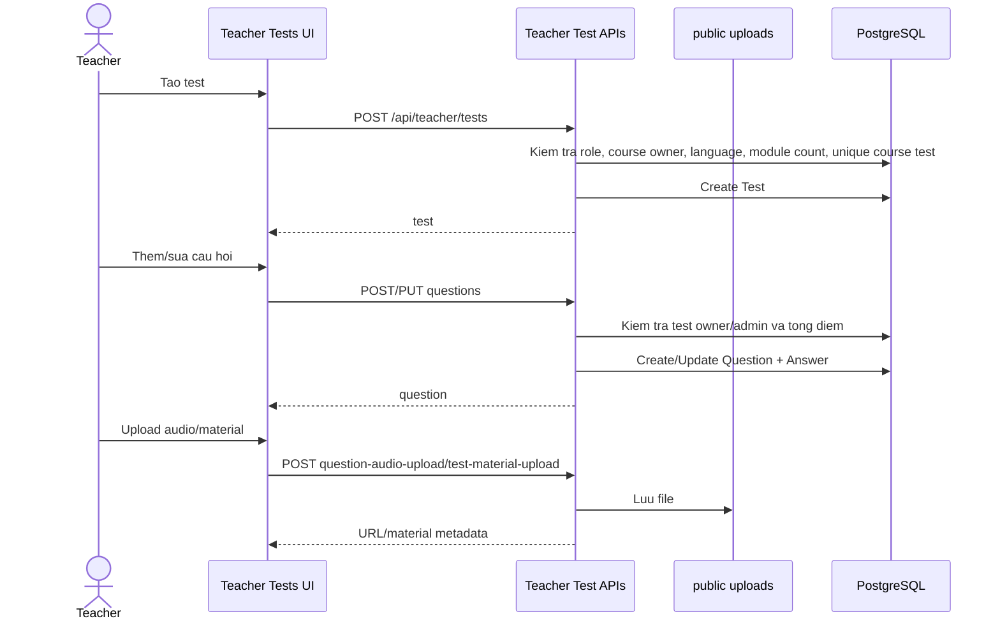
```mermaid
sequenceDiagram
  actor Teacher
  participant UI as Teacher Tests UI
  participant API as Teacher Test APIs
  participant FS as public uploads
  participant DB as PostgreSQL

  Teacher->>UI: Tao test
  UI->>API: POST /api/teacher/tests
  API->>DB: Kiem tra role, course owner, language, module count, unique course test
  API->>DB: Create Test
  API-->>UI: test
  Teacher->>UI: Them/sua cau hoi
  UI->>API: POST/PUT questions
  API->>DB: Kiem tra test owner/admin va tong diem
  API->>DB: Create/Update Question + Answer
  API-->>UI: question
  Teacher->>UI: Upload audio/material
  UI->>API: POST question-audio-upload/test-material-upload
  API->>FS: Luu file
  API-->>UI: URL/material metadata
```

## UC19 - Teacher xem hoc vien va rut doanh thu

Endpoints:

- `GET /api/teacher/students`
- `POST /api/teacher/revenue-withdrawals`
- Pages: `/teacher/students`, `/teacher/tests` revenue panel

Dieu kien:

- Chi `TEACHER` duoc tao request rut doanh thu.
- So tien rut khong vuot doanh thu kha dung = teacher revenue earned - pending/approved reserved withdrawals.

Ket qua:

- Liet ke hoc vien theo enrollment/course cua teacher.
- Tao `TeacherRevenueWithdrawal` status `PENDING`.

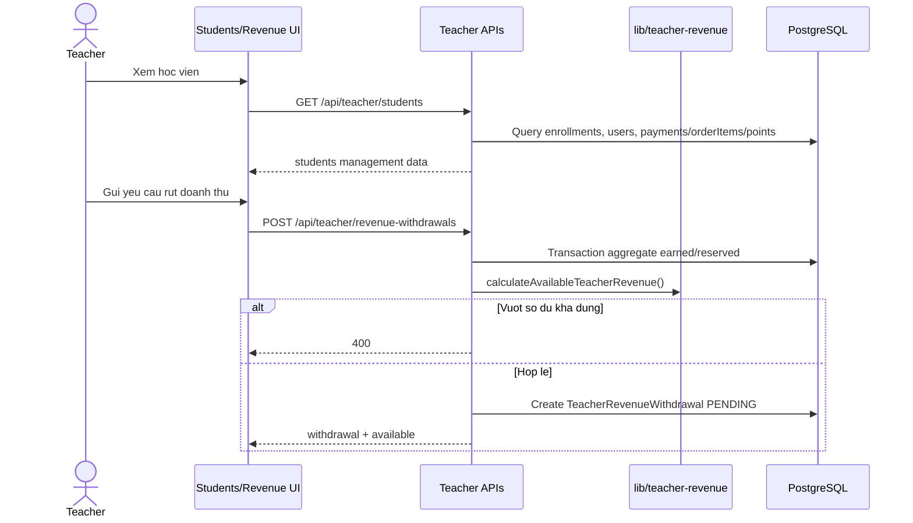
```mermaid
sequenceDiagram
  actor Teacher
  participant UI as Students/Revenue UI
  participant API as Teacher APIs
  participant Revenue as lib/teacher-revenue
  participant DB as PostgreSQL

  Teacher->>UI: Xem hoc vien
  UI->>API: GET /api/teacher/students
  API->>DB: Query enrollments, users, payments/orderItems/points
  API-->>UI: students management data
  Teacher->>UI: Gui yeu cau rut doanh thu
  UI->>API: POST /api/teacher/revenue-withdrawals
  API->>DB: Transaction aggregate earned/reserved
  API->>Revenue: calculateAvailableTeacherRevenue()
  alt Vuot so du kha dung
    API-->>UI: 400
  else Hop le
    API->>DB: Create TeacherRevenueWithdrawal PENDING
    API-->>UI: withdrawal + available
  end
```

## UC20 - Admin dashboard, setting, user va course approval

Endpoints:

- `GET /api/admin/analytics`
- `GET/PUT /api/admin/teacher-entrance`
- `GET/PUT /api/admin/course-approval`
- `GET/PUT /api/admin/speaking-config`
- `PATCH /api/admin/users/[userId]`
- `PATCH /api/teacher/courses/[courseId]` action `reviewCourse` hoac `toggleLock`
- Pages: `/admin`

Ket qua:

- Load analytics tong hop.
- Bat/tat dang ky giang vien, neu bat tu off sang on thi notify/email student.
- Bat/tat auto approval khoa hoc.
- Cap nhat config Speaking AI.
- Khoa/mo khoa user.
- Duyet/tu choi/khoa/mo khoa course.

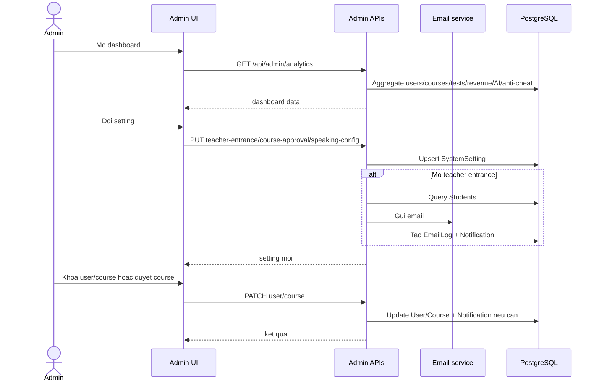
```mermaid
sequenceDiagram
  actor Admin
  participant UI as Admin UI
  participant API as Admin APIs
  participant Mail as Email service
  participant DB as PostgreSQL

  Admin->>UI: Mo dashboard
  UI->>API: GET /api/admin/analytics
  API->>DB: Aggregate users/courses/tests/revenue/AI/anti-cheat
  API-->>UI: dashboard data
  Admin->>UI: Doi setting
  UI->>API: PUT teacher-entrance/course-approval/speaking-config
  API->>DB: Upsert SystemSetting
  alt Mo teacher entrance
    API->>DB: Query Students
    API->>Mail: Gui email
    API->>DB: Tao EmailLog + Notification
  end
  API-->>UI: setting moi
  Admin->>UI: Khoa user/course hoac duyet course
  UI->>API: PATCH user/course
  API->>DB: Update User/Course + Notification neu can
  API-->>UI: ket qua
```

## UC21 - Admin xu ly rut doanh thu

Endpoint: `PATCH /api/admin/revenue-withdrawals/[withdrawalId]`

Luot trang thai:

- `PENDING -> APPROVED`
- `APPROVED -> PAID`
- `PENDING/APPROVED -> REJECTED`

Ket qua:

- Update `TeacherRevenueWithdrawal`.
- Tao notification cho teacher.

```mermaid
sequenceDiagram
  actor Admin
  participant UI as AdminRevenueWithdrawals
  participant API as Admin withdrawal API
  participant DB as PostgreSQL

  Admin->>UI: Approve/Pay/Reject request
  UI->>API: PATCH /api/admin/revenue-withdrawals/{id}
  API->>DB: Lay withdrawal hien tai
  alt Trang thai khong hop le
    API-->>UI: 409
  else Hop le
    API->>DB: Transaction update status/processedAt/note
    API->>DB: Tao Notification cho teacher
    API-->>UI: withdrawal moi
  end
```

## UC22 - Health check va route public phu tro

Endpoints/pages:

- `GET /api/health`: kiem tra app/database.
- `/about`, `/my-courses`, `/my-learning`, `/student`, `/student/rewards`, `/wallet`: cac page dieu huong/hien thi du lieu theo role.

```mermaid
sequenceDiagram
  actor User
  participant UI as Public/Utility pages
  participant API as /api/health
  participant DB as PostgreSQL

  User->>UI: Mo trang public/phu tro
  UI->>DB: Server components query du lieu neu can
  UI-->>User: Render page
  User->>API: GET /api/health
  API->>DB: SELECT 1
  API-->>User: status healthy/unhealthy
```

## Bang map nhanh endpoint - chuc nang

| Nhom | Endpoint | Chuc nang |
| --- | --- | --- |
| Auth | `/api/auth/register` | Dang ky student |
| Auth | `/api/auth/login`, `/api/auth/logout`, `/api/auth/me` | Dang nhap/xuat/current user |
| Auth | `/api/auth/forgot-password/request-otp`, `/api/auth/forgot-password/reset` | Quen mat khau OTP |
| Profile | `/api/profile`, `/api/profile/password` | Sua ho so, doi mat khau |
| Courses | `/api/courses`, `/api/courses/[id]/access`, `/api/courses/[id]/enroll`, `/api/courses/[id]/reviews` | Marketplace, access, mua course, review |
| Wallet | `/api/wallet`, `/api/wallet/top-up`, `/api/wallet/vnpay-ipn`, `/api/wallet/vnpay-return` | Vi va VNPAY |
| Learning | `/api/learning/lessons/[lessonId]/start`, `/complete` | Bat dau/hoan thanh lesson |
| Student tests | `/api/student/tests/**`, `/api/student/results/**` | Danh sach test, nop bai, lich su, ket qua |
| AI | `/api/ai/essay-evaluation`, `/api/ai/writing-prompt`, `/api/ai/speaking-evaluation/**`, `/api/ai/points/**` | Writing/Speaking AI va diem AI |
| Teacher application | `/api/teacher-applications/**` | Dang ky giang vien, anti-cheat, submit entrance test |
| Teacher | `/api/teacher/courses/**`, `/api/teacher/tests/**`, `/api/teacher/students`, `/api/teacher/revenue-withdrawals`, upload APIs | Quan ly khoa hoc, bai test, hoc vien, doanh thu |
| Admin | `/api/admin/**` | Analytics, setting, user, duyet ho so, duyet course, rut doanh thu |
| System | `/api/health`, `/api/languages` | Health check, ngon ngu |
